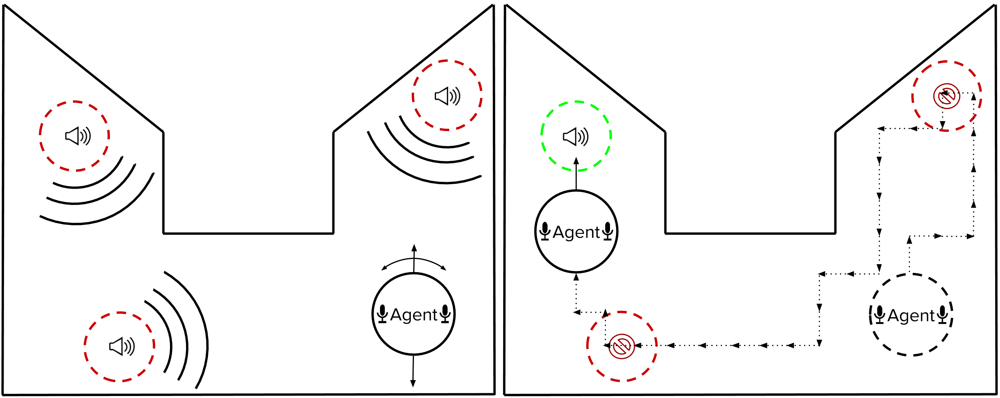

<h1 align="center">AuralNav</h1>

AuralNav is an interactive environment in which agents must learn to listen in order to solve navigational tasks. The purpose of AuralNav is to facilitate reinforcement learning research in computer audition, where agents must learn to listen to the world around them to navigate.

**Note:** Currently the focus is on audio source separation and localization.

AuralNav is built on three open source libraries: OpenAI [`gymnasium`](https://gymnasium.farama.org/) for environment and agent interaction, [`pyroomacoustics`](https://github.com/LCAV/pyroomacoustics) for ray-tracing and acoustics simulation, and [`asteroid`](https://github.com/asteroid-team/asteroid) for training deep computer audition models. AuralNav is the audio analogue of GridWorld, a simple navigation game that can be easily extended to more complex environments.

To solve one episode of AuralNav, an agent must move towards each sounding source in the auditory scene and "turn it off". The agent receives no other input than the current sound of the room. The sources are placed randomly within the room and can vary in number. The agent receives a reward for turning off a source.

<br>



## Features

- **Deep Q-Network (DQN)** reinforcement learning algorithm with experience replay
- **Recurrent Neural Network** for audio source separation and feature extraction
- **Enhanced Visualization** showing agent trajectory and source detection events
- **TensorBoard Integration** for tracking training metrics
- **Customizable Environment** with configurable room types and source placement


## Installation 
Clone the repository
```bash
git clone https://github.com/yourusername/AuralNav.git
```
Create a virtual environment: 
```bash
python -m venv venv
``` 
Activate the environment:
```bash
source venv/bin/activate  # On Windows: venv\Scripts\activate
```
Install requirements:
```bash
pip install -r requirements.txt
```
Install ffmpeg (if not already installed):
```bash
# Ubuntu/Debian
sudo apt-get install ffmpeg

# macOS with Homebrew
brew install ffmpeg

# Windows
# Download from https://ffmpeg.org/download.html
```
If using a **CUDA-enabled GPU (highly recommended)**, install PyTorch with CUDA support:  
```bash
pip install torch torchvision torchaudio --extra-index-url https://download.pytorch.org/whl/cu117
```
otherwise: 
```bash
pip install torch torchvision torchaudio
```


## Additional Installation Notes - Linux
* Linux users may need to install the sound file library if it is not present in the system:
```bash
sudo apt-get install libsndfile1
```

## Visualizing Training Progress
AuralNav provides two ways to visualize training progress:

1. **Real-time episode visualizations** showing the agent's trajectory and source detections
```bash
python experiment/experiment1.py
```
Visualizations are automatically generated and saved to the `visualizations/` directory.

2. **TensorBoard metrics** for tracking rewards, losses, and other training metrics
```bash
tensorboard --logdir=runs --port=6006
```
Then open your browser and navigate to `http://localhost:6006`.

Alternatively, you can generate plots using the included utility:
```bash
python src/plot_runs.py
```

## Running Experiments
AuralNav includes two experiment configurations:

```bash
# Run experiment 1 (150 episodes)
cd experiment/
python experiment1.py

# Run experiment 2 (200 episodes)
python experiment2.py
```

You can customize these experiments or create your own by modifying the configuration parameters. A GPU running CUDA is highly recommended for meaningful experiments.

### Is It Running Properly?
You should see a message indicating the experiment is running, such as this:
```
------------------------------ 
- Starting to Fit Agent
------------------------------- 
```

The terminal will display information about source locations, agent movement, and rewards received. You'll also see messages when the agent successfully detects sources:

```
Agent has found source ../sounds/siren/siren.wav.
Agent loc: [5.48227103 5.91024018], Source loc: [5.635482199008357, 5.0]
Visualization: Recorded detection of source 2 at step 466
```

## Key Components

### Agent Architecture
The agent uses a recurrent neural network (RNN) to process audio inputs and extract features, which are then fed into a Deep Q-Network (DQN) to determine the optimal action. The system includes:

- Experience replay for stable learning
- Target networks for reducing overestimation bias
- Epsilon-greedy exploration strategy
- Audio source separation capabilities through Asteroid

### Visualization System
The visualization system provides detailed insights into the agent's behavior:

- Room layout with source positions
- Agent trajectory with color gradient to show progression
- Source detection events with connecting lines to sources
- Detection markers with step information
- Episode summary statistics

## Credits and Acknowledgments

This project is based on the original OtoWorld framework developed by Omkar Ranadive, Grant Gasser, David Terpay, and Prem Seetharaman. AuralNav extends and enhances the core functionality with improved visualizations, Gymnasium compatibility, and better audio processing capabilities using Asteroid.

### Original OtoWorld Paper:
```
@inproceedings {otoworld
    author = {Omkar Ranadive and Grant Gasser and David Terpay and Prem Seetharaman},
    title = "OtoWorld: Towards Learning to Separate by Learning to Move",
    journal = "Self Supervision in Audio and Speech Workshop, 37th International Conference on Machine Learning ({ICML} 2020), Vienna, Austria",
    year = 2020
}
```

### Original OtoWorld Repository:
https://github.com/pseeth/otoworld

## Future Roadmap and Research Directions

AuralNav is an ongoing research project with several planned enhancements and directions for future work:

### Core Environment Enhancements & Novel Tasks

#### Dynamic and Interactive Environments
- **Development**: Move beyond static sound sources to implement dynamic environments where sound sources move, change their characteristics (e.g., volume, pitch), or appear/disappear over time
- **Impact**: More realistic and challenging scenarios that allow for research into adaptive learning and real-time decision-making

#### Complex Soundscapes
- **Development**: Replace simple tones/sounds with complex, real-world soundscapes (e.g., urban environments, forests, offices)
- **Impact**: Significantly increases the difficulty of source separation and addresses the sim-to-real gap in audio research

#### Multi-Agent Scenarios
- **Development**: Extend to support multiple agents that can cooperate or compete in tasks requiring coordination based on auditory cues
- **Impact**: Explores the intersection of multi-agent reinforcement learning and computer audition

#### Realistic Sensor Modeling
- **Development**: Implement more realistic sensor models that simulate the limitations of real-world microphones
- **Impact**: Bridges the gap between simulation and real-world deployment

### Algorithmic Innovations & Learning Paradigms

#### Self-Supervised and Unsupervised Learning
- **Development**: Explore self-supervised techniques to pre-train the agent's auditory perception module
- **Impact**: Addresses sample efficiency problems in reinforcement learning

#### Meta-Learning for Rapid Adaptation
- **Development**: Apply meta-learning techniques for rapid adaptation to new environments
- **Impact**: Enables quick deployment of agents in unseen environments

#### Neuro-Inspired Architectures
- **Development**: Design neural network architectures inspired by the human auditory system
- **Impact**: Leads to more efficient and biologically plausible audio processing algorithms

#### Curriculum Learning and Task Decomposition
- **Development**: Implement curriculum learning strategies where the agent gradually learns more complex tasks
- **Impact**: Improves learning efficiency and enables agents to solve more challenging tasks

## Mesa Visualization

This project includes an interactive web-based visualization using Mesa.
To run the visualization:

1.  Ensure all dependencies are installed:
    ```bash
    pip install -r requirements.txt
    ```
    (Note: If you encounter issues with specific packages like `pyroomacoustics` or `soxbindings` during this step, ensure you have their system-level dependencies installed. For `pyroomacoustics`, this might include Python development headers (`python3-dev` on Debian/Ubuntu) and for `soxbindings` it would be `libsox-dev`. The core `mesa` dependency should install without these if they are problematic for your system.)

2.  Navigate to the `src` directory (if you are in the repository root):
    ```bash
    cd src
    ```
    (Or adjust the run command if you prefer to run from the root)
3.  Run the Mesa server:
    ```bash
    python -m mesa_visualization.server
    ```
    Alternatively, if you are in the `src/mesa_visualization` directory:
    ```bash
    python server.py
    ```
    Or from the project root:
    ```bash
    python src/mesa_visualization/server.py
    ```

4.  Open your web browser and go to `http://127.0.0.1:8521` (or the port specified in the server script if changed).

You should see the simulation running and be able to observe the agent's behavior in the environment.
